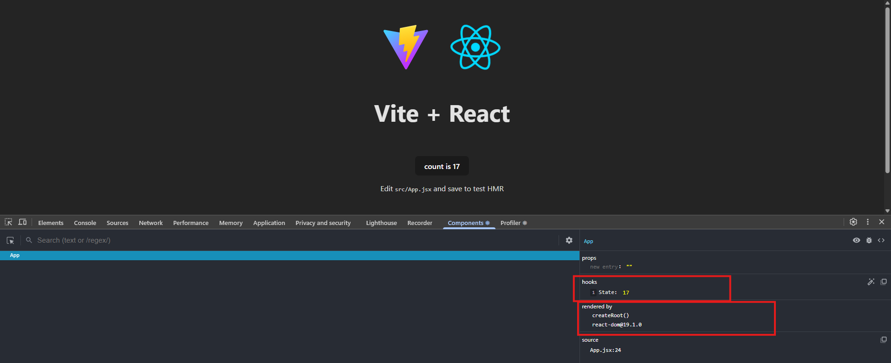
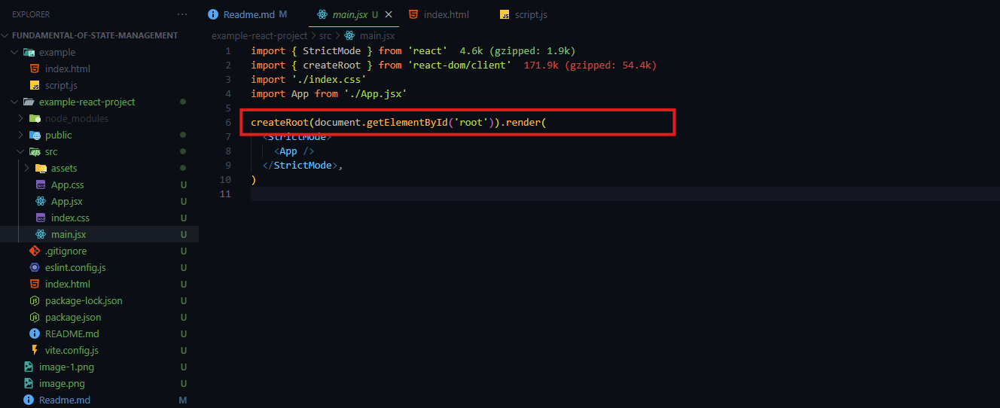

# Fundamental Of State Management

Welcome to your next journey — Be a Redux Reaper 🔥


Before we dive into Redux itself, it's crucial to master the foundation of state management. That’s exactly what this first module is all about.


🧠 From understanding what state really is, to how it triggers re-renders, works behind the scenes, and when to use useState vs useReducer — we’ll break down the core concepts of state in React like never before.


Whether you're new to state or looking to solidify your fundamentals, this module will sharpen your instincts — so when Redux enters the scene, you’ll already be ahead.

Let’s begin by decoding the essence of UI logic — the State.

## 20-1 What is State? Understanding the Core of UI Logic

#### What is state?
- Sate Means Present situation. Where data is for long run. data is not state

#### Types Of State 
1. Local state (Initially we will deal with local state)
2. remote state 
3. server state 

- When a user comes to a website and takes action the state changes 
- In single page application we just have index.htm and <div id=""> </div> inside it content changes because of state changes like different page appears inside the div.
- React's default state management is not that robust. so fo this reason we use third party state management tool like redux. 
- Here we can say state is current situation's data. based on the state change different interaction happens. 

## 20-2 How State Triggers Renders in React

#### What is Render? 
- Render Means Showing something inside browser's frame. Its like we will do something that will trigger browser rendering and show something in our ui

#### What is the relation between state and render? 
- For each state change correspondingly we need to trigger a render. 

```html

<!DOCTYPE html>
<html lang="en">
<head>
  <title>Document</title>
  <script src="https://cdn.jsdelivr.net/npm/@tailwindcss/browser@4"></script>
</head>
<body>
  <div id="app" class="flex items-center justify-center min-h-screen bg-gray-100">
    <div class="flex items-center gap-6 bg-white p-8 rounded-lg shadow-lg">
      
      <button id="decrement" class="px-4 py-2 bg-red-500 text-white rounded hover:bg-red-600 transition">
        Decrement
      </button>

      <span id="count" class="text-3xl font-bold w-12 text-center">0</span>

      <button id="increment" class="px-4 py-2 bg-green-500 text-white rounded hover:bg-green-600 transition">
        Increment
      </button>

    </div>
  </div>

  <script src="script.js"></script>
</body>
</html>

```


```js
let count = 0; // state

const render = () => {
    document.getElementById("count").innerHTML = count;
};

const increment = () => {
    count++;
    render(); // ← call render after incrementing
};

const decrement = () => {
    count--;
    render(); // ← call render after decrementing
};

document.getElementById("increment").addEventListener("click", increment);
document.getElementById("decrement").addEventListener("click", decrement);

// render initially to display the starting count
render();


```


## 20-3 React State & Re-Renders: Stateless vs Stateful
- Lets Understand State Change and render Inside React
- Chrome Dev Tool -> Components -> settings -> Highlight updates when components render. check this 
- We can see if a state changes whole react component re render happens. not the specific element 


- And this is rendered by createRoot 





- states, useEffect are hold inside hooks. Hooks are traced using link list inside fiber. 
- The summary is react renders component when any state changes. 
- Re render triggering and changing content inside a component is not same thing.

#### Why Fiber is required? 
- React used to run on class based component. but now a days react uses functional based. 
- When we work with object oriented programming- object is by default stateful and that means we can keep state inside it. 

```js
const counter = {
    count: 0,
    increment(newCount) {
        this.count += newCount
        console.log(this.count)
    }
}

counter.increment(1)
counter.increment(3)
counter.increment(5)
```

- Inside Functional programming function is stateless and we can not hold any sate inside it. Function works based on the inputs. 

```js 
const counter2 = (newCount) =>{
    let count = 0;
    return count + newCount
}

console.log(counter2(1))
console.log(counter2(3))
console.log(counter2(5))
```

- here we can see there is not scope to trace the state.
- To trace the state we need to declare the count outside the block. Here comes the help of state of react which is handled outside the function and is traced. 

## 20-4 How useState Works Behind the Scenes (Simulated in Vanilla JS)

- Being function base(stateless) how react handles state? lets simulate using vanilla js 
- Inside if else condition and loop we can not call hooks. Hook Must be in top level of component. 
- An IIFE (Immediately Invoked Function Expression) is a JavaScript function that runs as soon as it is defined.

```js

const React = (() => {
    const useState = (initialValue) => {
        let state = initialValue
        const setter = (newSate) => {
            state = newSate
        }
        return [state, setter]
    };
    return {
        useState
    }
})()

const { useState } = React //export component

// component 
const Component = () => {
    const [count, setCount] = useState(1)
    console.log(count)
    setCount(2)
}

Component() // render the component

Component() // gain calling for re render after setting the value

```

- as function is state less we will get 1 not the set value 2 even after 2 times re render. 
- We just have to handle this state outside the function 

```js 

const React = (() => {
    let state;

    const useState = (initialValue) => {

        if (state === undefined) {
            state = initialValue
        }
        const setter = (newSate) => {
            state = newSate
        }
        return [state, setter]
    };
    return {
        useState
    }
})()

const { useState } = React //export component

// component 
const Component = () => {
    const [count, setCount] = useState(1)
    console.log(count)
    setCount(2)
}

Component() // render the component

Component() // gain calling for re render after setting the value
```

- behind the scene react uses link list to hold multiple state data 
- Index rest is done after each render in react 

```js


const React = (() => {
    let state = [] // behind the scene react uses link list to hold multiple state data 

    let index = 0;

    const useState = (initialValue) => {

        let hookIndex = index;
        index++


        if (state[hookIndex] === undefined) {
            state[hookIndex] = initialValue
        }
        const setter = (newSate) => {
            state[hookIndex] = newSate
        }
        return [state[hookIndex], setter]
    };

    const resetIndex = () => {
        index = 0
    }

    return {
        useState,
        resetIndex
    }
})()

const { useState, resetIndex } = React //export component

// component 
const Component = () => {
    const [count, setCount] = useState(1)
    const [name, setName] = useState("Sazid")
    console.log(count)
    console.log(name)
    setCount(2)
    setName("Mazid")
}

Component() // render the component
resetIndex()
Component() // gain calling for re render after setting the value
```

## 20-5 React Reconciler & Fiber Explained Simply
- React Core is called reconciler . The work of reconciler is simple like we are giving inputs and the state changes are triggered and the overall executions are done by reconciler. (changes are made using reconciler)
- Here we have two phases 
  1. Compares virtual dom with real dom (Diffing Algorithm)
  2. Calculates the difference (called the diff) and builds a list of updates

- Previously stack was used

- Stack (LIFO – Last In, First Out)
  1. The last item added is the first one removed.
  2. Think of a stack of plates: you add to the top and remove from the top.

- Queue (FIFO – First In, First Out)
  1. The first item added is the first one removed.
  2. Think of a queue in a line: the person who comes first gets served first.

- The main problem of stack was it was synchronous. When it was a task of network call it has to wait and synchronous can not perform here. must be asynchronous.
- Because of being synchronous the problem was reconciler was struggling to render the contents properly 
- For solving this problem react brought react fiber. 

#### What is fiber? 
- It simply means unit of work (singular work)
- Its just a plain object 
- Now the reconciler became asynchronous
- Now Fiber Reconciler can do scheduling for us. can set the priority of a task. 
- When we call a hook it is stored inside fiber
- When we make a component react makes a fiber node for it. Fiber node is a object and holds a lot of property like(type, memorizeState). links list are stored inside memorizeState. for this reason thinks do not disappeared

#### Fiber Reconciler 
- Fiber reconciler has two phases 

  1. Render 
   - all synchronous works are done inside render
   - When a state changes fiber node becomes dirty that means some changes has came. and then fiber node's _currentExecution(in function based), .update (class component) appended inside the reconciler. Then the update is added inside a que. and this says that the component is added inside the que and need to be rerendered. 
   - From tracing what is difference between real and actual dom to adding to que is done inside render. 

  2. Commit 
   - After the render phase commit phase runs. 
   - Here changes are made inside the dom. 
   - Finally Clear the que

## 20-6 Synchronous vs Asynchronous Behavior of useState

- now lets see how state access the memory 

```jsx
const [count, setCount] = useState(0)
```

- Here setCount is synchronous function in react 
- When we Interact this with a asynchronous function then It Becomes a hassle 

```jsx
import { useState } from "react";

function App() {
  const [count, setCount] = useState(0);

  const increment = () => {
    setCount(count + 1);
  };
  const asyncIncrement = () => {
    setTimeout(() => {

      setCount(count + 1);

    }, 3000);
  };

  return (
    <div>
      <p>Count: {count}</p>
      <button onClick={increment}>Increment</button>
      <button onClick={asyncIncrement}>Async Increment</button>
    </div>
  );
}

export default App;

```

- the problem is here that during the setTimeOut Interval it take a value and starts to calculate. in this mean time if we do synchronous increment value is updated but the logic inside the asynchronous function keeps working with the previous value and sets in the state. 
- We can solve this problem by using callback function. callback function takes the value from the memory directly and we do not provide value directly 

```jsx
import { useState } from "react";

function App() {
  const [count, setCount] = useState(0);

  const increment = () => {
    setCount(count + 1);
  };
  const asyncIncrement = () => {
    setTimeout(() => {

      // using callback
      setCount((prevCount) => prevCount + 1);

    }, 3000);
  };

  return (
    <div>
      <p>Count: {count}</p>
      <button onClick={increment}>Increment</button>
      <button onClick={asyncIncrement}>Async Increment</button>
    </div>
  );
}

export default App;

```

## 20-7 What Are Signals? The Future of Reactive State

#### what is signal? 
- Signal is also a state. Its not just a normal state. rather its a reactive state. 
- signal is consist of two things 
  1. Getter 
  2. Setter 
- When we take value from a state we call it pure value but In signal we do not get pure value. rather we call `Getter` and the getter gives us the value.
- The facility of this is called `Fine-Grained Reactivity`. 
- When a state changes in regular react app entire component changes.
- But If we use signal it just changes the specific element that is supposed to change.
- In nowadays we do not use signals with react. but in Future it will come soon.
- In vue the signal is called Ref [Signal In Vue](https://vuejs.org/api/reactivity-core.html#ref)
- Using Preact we can use the signal but is not that stable
- The concept of signal came from solid.js [signal Concept](https://www.solidjs.com/guides/getting-started)

```jsx
const [first, setFirst] = createSignal("JSON");
const [last, setLast] = createSignal("Bourne");

createEffect(() => console.log(`${first()} ${last()}`));
```
- Here first is getter


## 20-8 Using Objects as State in React: Gotchas & Best Practices
- when a input field is not hooked with react state that is called uncontrolled input. Otherwise its controlled.  

```js
import { useState } from "react";

function App() {
  const [name, setName] = useState("");
  const [email, setEmail] = useState("");
  const [phone, setPhone] = useState("");

  const handleSubmit = (e) => {
    e.preventDefault();
    console.log({ name, email, phone });
  };

  return (
    <div>
      <form onSubmit={handleSubmit}>
        <div>
          <label htmlFor="name">Name</label><br />
          <input
            type="text"
            name="name"
            id="name"
            value={name}
            onChange={(e) => setName(e.target.value)}
          />
        </div>
        <div>
          <label htmlFor="email">Email</label><br />
          <input
            type="email"
            name="email"
            id="email"
            value={email}
            onChange={(e) => setEmail(e.target.value)}
          />
        </div>
        <div>
          <label htmlFor="phone">Phone</label><br />
          <input
            type="tel"
            name="phone"
            id="phone"
            value={phone}
            onChange={(e) => setPhone(e.target.value)}
          />
        </div>
        <div>
          <button type="submit">Submit</button>
        </div>
      </form>
    </div>
  );
}

export default App;

```

- lets centralize the user Inputs 

```js 
import { useState } from "react";

function App() {
  const [userInfo, setUserInfo] = useState({
    name: "",
    email: "",
    phone: ""
  });

  const userInfoUpdate = (value) => {
    setUserInfo(value)
  }

  const handleSubmit = (e) => {
    e.preventDefault();
    console.log(userInfo);
  };

  return (
    <div>
      <form onSubmit={handleSubmit}>
        <div>
          <label htmlFor="name">Name</label><br />
          <input
            type="text"
            name="name"
            id="name"
            value={userInfo.name}
            onChange={(e) => userInfoUpdate(e.target.value)}
          />
        </div>
        <div>
          <label htmlFor="email">Email</label><br />
          <input
            type="email"
            name="email"
            id="email"
            value={userInfo.email}
            onChange={(e) => userInfoUpdate(e.target.value)}
          />
        </div>
        <div>
          <label htmlFor="phone">Phone</label><br />
          <input
            type="tel"
            name="phone"
            id="phone"
            value={userInfo.phone}
            onChange={(e) => userInfoUpdate(e.target.value)}
          />
        </div>
        <div>
          <button type="submit">Submit</button>
        </div>
      </form>
    </div>
  );
}

export default App;

```

- There is a problem the objet is being muted by the last value. Means the phone number is replacing the entire object. Mutation is happening. 
- In Redux we have to deal with this too
- Lets deal the mutation here. 

```jsx
import { useState } from "react";

function App() {
  const [userInfo, setUserInfo] = useState({
    name: "",
    email: "",
    phone: ""
  });

  const userInfoUpdate = (input, value) => {
    setUserInfo({ ...userInfo, [input]: value })
  }

  const handleSubmit = (e) => {
    e.preventDefault();
    console.log(userInfo);
  };

  return (
    <div>
      <form onSubmit={handleSubmit}>
        <div>
          <label htmlFor="name">Name</label><br />
          <input
            type="text"
            name="name"
            id="name"
            value={userInfo.name}
            onChange={(e) => userInfoUpdate(e.target.name, e.target.value)}
          />
        </div>
        <div>
          <label htmlFor="email">Email</label><br />
          <input
            type="email"
            name="email"
            id="email"
            value={userInfo.email}
            onChange={(e) => userInfoUpdate(e.target.name, e.target.value)}
          />
        </div>
        <div>
          <label htmlFor="phone">Phone</label><br />
          <input
            type="tel"
            name="phone"
            id="phone"
            value={userInfo.phone}
            onChange={(e) => userInfoUpdate(e.target.name, e.target.value)}
          />
        </div>
        <div>
          <button type="submit">Submit</button>
        </div>
      </form>
    </div>
  );
}

export default App;

```

- basically for this kind of object input fields useReducer is mostly used. Redux used to use useReducer Earlier. 

## 20-9 useReducer: When useState Isn’t Enough
- Lets Optimize the code more

```jsx
import { useState } from "react";

function App() {
  const [userInfo, setUserInfo] = useState({
    name: "",
    email: "",
    phone: ""
  });

  const userInfoUpdate = (e) => {
    setUserInfo({ ...userInfo, [e.target.name]: e.target.value })
  }

  const handleSubmit = (e) => {
    e.preventDefault();
    console.log(userInfo);
  };

  return (
    <div>
      <form onSubmit={handleSubmit}>
        <div>
          <label htmlFor="name">Name</label><br />
          <input
            type="text"
            name="name"
            id="name"
            value={userInfo.name}
            onChange={userInfoUpdate}
          />
        </div>
        <div>
          <label htmlFor="email">Email</label><br />
          <input
            type="email"
            name="email"
            id="email"
            value={userInfo.email}
            onChange={userInfoUpdate}
          />
        </div>
        <div>
          <label htmlFor="phone">Phone</label><br />
          <input
            type="tel"
            name="phone"
            id="phone"
            value={userInfo.phone}
            onChange={userInfoUpdate}
          />
        </div>
        <div>
          <button type="submit">Submit</button>
        </div>
      </form>
    </div>
  );
}

export default App;


```

#### Lets Start To Use useReducer

```jsx
import { useReducer } from "react";

function App() {
  // const [userInfo, setUserInfo] = useState({
  //   name: "",
  //   email: "",
  //   phone: ""
  // });

  // const handleOnChange = (e) => {
  //   setUserInfo({ ...userInfo, [e.target.name]: e.target.value })
  // }

  const initialState = {
    name: "",
    email: "",
    phone: ""

  }

  // what is inside action ? 

  // {
  //   type: "_FIELD_UPDATE";
  //   payload: {
  //     field: "name",
  //       value: "PH"
  //   }
  // }

  const reducer = (state, action) => {
    switch (action.type) {
      case "FIELD_UPDATE":
        return {
          ...state,
          [action.payload.field]: action.payload.value
        };
      default:
        return state;
    }
  }


  // takes gives userInfo and dispatch (not a saved function)
  // takes reducer function and initial arguments 
  const [userInfo, dispatch] = useReducer(reducer, initialState)

  console.log(userInfo)

  // to send the action to the reducer we need the help of dispatch. 
  // when we dispatch anything the thing goes to action 
  const handleOnChange = (e) => {
    dispatch({
      type: "FIELD_UPDATE",
      payload: {
        field: e.target.name,
        value: e.target.value,
      },
    });
  }
  const handleSubmit = (e) => {
    e.preventDefault();
    console.log(userInfo);
  };

  return (
    <div>
      <form onSubmit={handleSubmit}>
        <div>
          <label htmlFor="name">Name</label><br />
          <input
            type="text"
            name="name"
            id="name"
            value={userInfo.name}
            onChange={handleOnChange}
          />
        </div>
        <div>
          <label htmlFor="email">Email</label><br />
          <input
            type="email"
            name="email"
            id="email"
            value={userInfo.email}
            onChange={handleOnChange}
          />
        </div>
        <div>
          <label htmlFor="phone">Phone</label><br />
          <input
            type="tel"
            name="phone"
            id="phone"
            value={userInfo.phone}
            onChange={handleOnChange}
          />
        </div>
        <div>
          <button type="submit">Submit</button>
        </div>
      </form>
    </div>
  );
}

export default App;


```


## 20-10 Enhancing useReducer with Business Logic

- Previously Redux used to use useReducer. Which is redux's architecture. then react made a hook with it. 
- The main purpose useReducer is it is making us to separate the business logics so that we can implement any business logic. which makes more scalable and robust. 


```jsx
import { useReducer } from "react";

function App() {
  // const [userInfo, setUserInfo] = useState({
  //   name: "",
  //   email: "",
  //   phone: ""
  // });

  // const handleOnChange = (e) => {
  //   setUserInfo({ ...userInfo, [e.target.name]: e.target.value })
  // }

  const initialState = {
    name: "",
    email: "",
    phone: ""

  }

  // what is inside action ? 

  // {
  //   type: "_FIELD_UPDATE";
  //   payload: {
  //     field: "name",
  //       value: "PH"
  //   }
  // }

  const reducer = (state, action) => {
    switch (action.type) {
      case "FIELD_UPDATE":
        return {
          ...state,
          [action.payload.field]: action.payload.value
        };
      case "RESET":
        return initialState

      case "CLEAR":
        return {
          ...state,
          [action.payload.field]: ""
        };

      default:
        return state;
    }
  }


  // takes gives userInfo and dispatch (not a saved function)
  // takes reducer function and initial arguments 
  const [userInfo, dispatch] = useReducer(reducer, initialState)

  console.log(userInfo)

  // to send the action to the reducer we need the help of dispatch. 
  // when we dispatch anything the thing goes to action 
  const handleOnChange = (e) => {
    dispatch({
      type: "FIELD_UPDATE",
      payload: {
        field: e.target.name,
        value: e.target.value,
      },
    });
  }

  const handleClear = (field) => {
    dispatch({
      type: "CLEAR",
      payload: {
        field: field,
      },
    });
  }
  const handleSubmit = (e) => {
    e.preventDefault();
    console.log(userInfo);
  };

  return (
    <div>
      <form onSubmit={handleSubmit}>
        <div>
          <label htmlFor="name">Name</label><br />
          <input
            type="text"
            name="name"
            id="name"
            value={userInfo.name}
            onChange={handleOnChange}
          />
          <button onClick={() => handleClear("name")}>Clear</button>
        </div>
        <div>
          <label htmlFor="email">Email</label><br />
          <input
            type="email"
            name="email"
            id="email"
            value={userInfo.email}
            onChange={handleOnChange}
          />
          <button onClick={() => handleClear("name")}>Clear</button>
        </div>
        <div>
          <label htmlFor="phone">Phone</label><br />
          <input
            type="tel"
            name="phone"
            id="phone"
            value={userInfo.phone}
            onChange={handleOnChange}
          />
          <button onClick={() => handleClear("name")}>Clear</button>
        </div>
        <div>
          <button onClick={() => dispatch({ type: "RESET" })}>Reset</button>
          <button type="submit">Submit</button>
        </div>
      </form>
    </div>
  );
}

export default App;

```