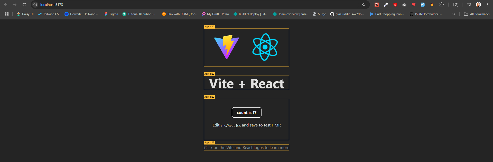

# Fundamental Of State Management

Welcome to your next journey — Be a Redux Reaper 🔥


Before we dive into Redux itself, it's crucial to master the foundation of state management. That’s exactly what this first module is all about.


🧠 From understanding what state really is, to how it triggers re-renders, works behind the scenes, and when to use useState vs useReducer — we’ll break down the core concepts of state in React like never before.


Whether you're new to state or looking to solidify your fundamentals, this module will sharpen your instincts — so when Redux enters the scene, you’ll already be ahead.

Let’s begin by decoding the essence of UI logic — the State.

## 20-1 What is State? Understanding the Core of UI Logic

#### What is state?
- Sate Means Present situation. Where data is for long run. data is not state

#### Types Of State 
1. Local state (Initially we will deal with local state)
2. remote state 
3. server state 

- When a user comes to a website and takes action the state changes 
- In single page application we just have index.htm and <div id=""> </div> inside it content changes because of state changes like different page appears inside the div.
- React's default state management is not that robust. so fo this reason we use third party state management tool like redux. 
- Here we can say state is current situation's data. based on the state change different interaction happens. 

## 20-2 How State Triggers Renders in React

#### What is Render? 
- Render Means Showing something inside browser's frame. Its like we will do something that will trigger browser rendering and show something in our ui

#### What is the relation between state and render? 
- For each state change correspondingly we need to trigger a render. 

```html

<!DOCTYPE html>
<html lang="en">
<head>
  <title>Document</title>
  <script src="https://cdn.jsdelivr.net/npm/@tailwindcss/browser@4"></script>
</head>
<body>
  <div id="app" class="flex items-center justify-center min-h-screen bg-gray-100">
    <div class="flex items-center gap-6 bg-white p-8 rounded-lg shadow-lg">
      
      <button id="decrement" class="px-4 py-2 bg-red-500 text-white rounded hover:bg-red-600 transition">
        Decrement
      </button>

      <span id="count" class="text-3xl font-bold w-12 text-center">0</span>

      <button id="increment" class="px-4 py-2 bg-green-500 text-white rounded hover:bg-green-600 transition">
        Increment
      </button>

    </div>
  </div>

  <script src="script.js"></script>
</body>
</html>

```


```js
let count = 0; // state

const render = () => {
    document.getElementById("count").innerHTML = count;
};

const increment = () => {
    count++;
    render(); // ← call render after incrementing
};

const decrement = () => {
    count--;
    render(); // ← call render after decrementing
};

document.getElementById("increment").addEventListener("click", increment);
document.getElementById("decrement").addEventListener("click", decrement);

// render initially to display the starting count
render();


```


## 20-3 React State & Re-Renders: Stateless vs Stateful
- Lets Understand State Change and render Inside React
- Chrome Dev Tool -> Components -> settings -> Highlight updates when components render. check this 
- We can see if a state changes whole react component re render happens. not the specific element 



- And this is rendered by createRoot 


- states, useEffect are hold inside hooks. Hooks are traced using link list inside fiber. 
- The summary is react renders component when any state changes. 
- Re render triggering and changing content inside a component is not same thing.

#### Why Fiber is required? 
- React used to run on class based component. but now a days react uses functional based. 
- When we work with object oriented programming- object is by default stateful and that means we can keep state inside it. 

```js
const counter = {
    count: 0,
    increment(newCount) {
        this.count += newCount
        console.log(this.count)
    }
}

counter.increment(1)
counter.increment(3)
counter.increment(5)
```

- Inside Functional programming function is stateless and we can not hold any sate inside it. Function works based on the inputs. 

```js 
const counter2 = (newCount) =>{
    let count = 0;
    return count + newCount
}

console.log(counter2(1))
console.log(counter2(3))
console.log(counter2(5))
```

- here we can see there is not scope to trace the state.
- To trace the state we need to declare the count outside the block. Here comes the help of state of react which is handled outside the function and is traced. 

## 20-4 How useState Works Behind the Scenes (Simulated in Vanilla JS)

- Being function base(stateless) how react handles state? lets simulate using vanilla js 
- Inside if else condition and loop we can not call hooks. Hook Must be in top level of component. 
- An IIFE (Immediately Invoked Function Expression) is a JavaScript function that runs as soon as it is defined.

```js

const React = (() => {
    const useState = (initialValue) => {
        let state = initialValue
        const setter = (newSate) => {
            state = newSate
        }
        return [state, setter]
    };
    return {
        useState
    }
})()

const { useState } = React //export component

// component 
const Component = () => {
    const [count, setCount] = useState(1)
    console.log(count)
    setCount(2)
}

Component() // render the component

Component() // gain calling for re render after setting the value

```

- as function is state less we will get 1 not the set value 2 even after 2 times re render. 
- We just have to handle this state outside the function 

```js 

const React = (() => {
    let state;

    const useState = (initialValue) => {

        if (state === undefined) {
            state = initialValue
        }
        const setter = (newSate) => {
            state = newSate
        }
        return [state, setter]
    };
    return {
        useState
    }
})()

const { useState } = React //export component

// component 
const Component = () => {
    const [count, setCount] = useState(1)
    console.log(count)
    setCount(2)
}

Component() // render the component

Component() // gain calling for re render after setting the value
```

- behind the scene react uses link list to hold multiple state data 
- Index rest is done after each render in react 

```js


const React = (() => {
    let state = [] // behind the scene react uses link list to hold multiple state data 

    let index = 0;

    const useState = (initialValue) => {

        let hookIndex = index;
        index++


        if (state[hookIndex] === undefined) {
            state[hookIndex] = initialValue
        }
        const setter = (newSate) => {
            state[hookIndex] = newSate
        }
        return [state[hookIndex], setter]
    };

    const resetIndex = () => {
        index = 0
    }

    return {
        useState,
        resetIndex
    }
})()

const { useState, resetIndex } = React //export component

// component 
const Component = () => {
    const [count, setCount] = useState(1)
    const [name, setName] = useState("Sazid")
    console.log(count)
    console.log(name)
    setCount(2)
    setName("Mazid")
}

Component() // render the component
resetIndex()
Component() // gain calling for re render after setting the value
```

## 20-5 React Reconciler & Fiber Explained Simply
- React Core is called reconciler . The work of reconciler is simple like we are giving inputs and the state changes are triggered and the overall executions are done by reconciler. (changes are made using reconciler)
- Here we have two phases 
  1. Compares virtual dom with real dom (Diffing Algorithm)
  2. Calculates the difference (called the diff) and builds a list of updates
- Previously stack was used

- Stack (LIFO – Last In, First Out)
  1. The last item added is the first one removed.
  2. Think of a stack of plates: you add to the top and remove from the top.

- Queue (FIFO – First In, First Out)
  1. The first item added is the first one removed.
  2. Think of a queue in a line: the person who comes first gets served first.

- The main problem of stack was it was synchronous. When it was a task of network call it has to wait and synchronous can not perform here. must be asynchronous.
- Because of being synchronous the problem was reconciler was struggling to render the contents properly 
- For solving this problem react brought react fiber. 

#### What is fiber? 
- It simply means unit of work (singular work)
- Its just a plain object 
- Now the reconciler became asynchronous
- Now Fiber Reconciler can do scheduling for us. can set the priority of a task. 
- When we call a hook it is stored inside fiber
- When we make a component react makes a fiber node for it. Fiber node is a object and holds a lot of property like(type, memorizeState). links list are stored inside memorizeState. for this reason thinks do not disappeared

#### Fiber Reconciler 
- Fiber reconciler has two phases 

  1. Render 
   - all synchronous works are done inside render
   - When a state changes fiber node becomes dirty that means some changes has came. and then fiber node's _currentExecution(in function based), .update (class component) appended inside the reconciler. Then the update is added inside a que. and this says that the component is added inside the que and need to be rerendered. 
   - From tracing what is difference between real and actual dom to adding to que is done inside render. 

  2. Commit 
   - After the render phase commit phase runs. 
   - Here changes are made inside the dom. 
   - Finally Clear the que